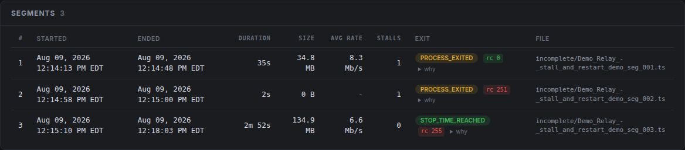
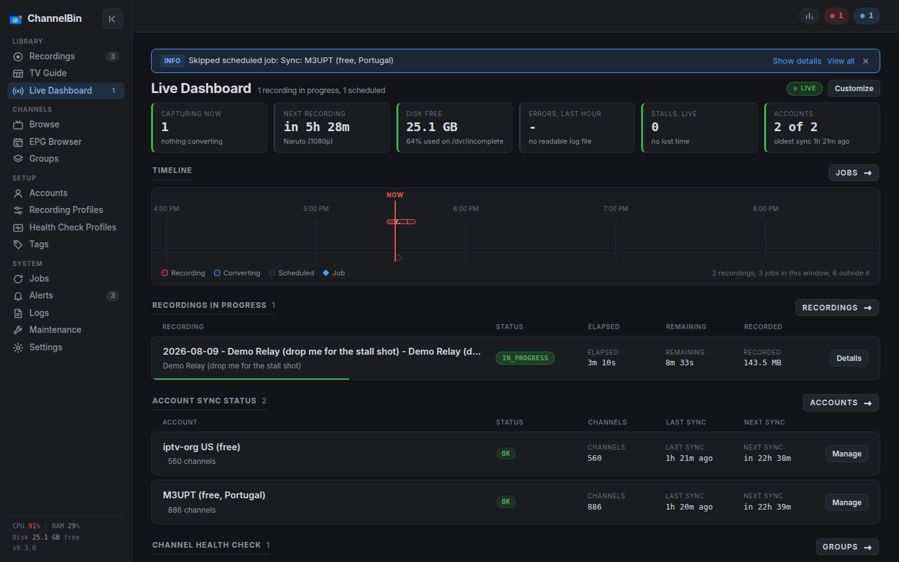
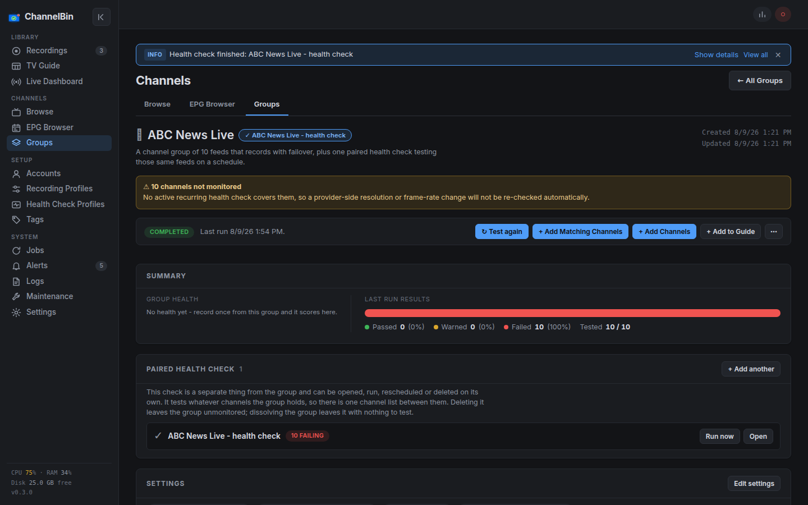
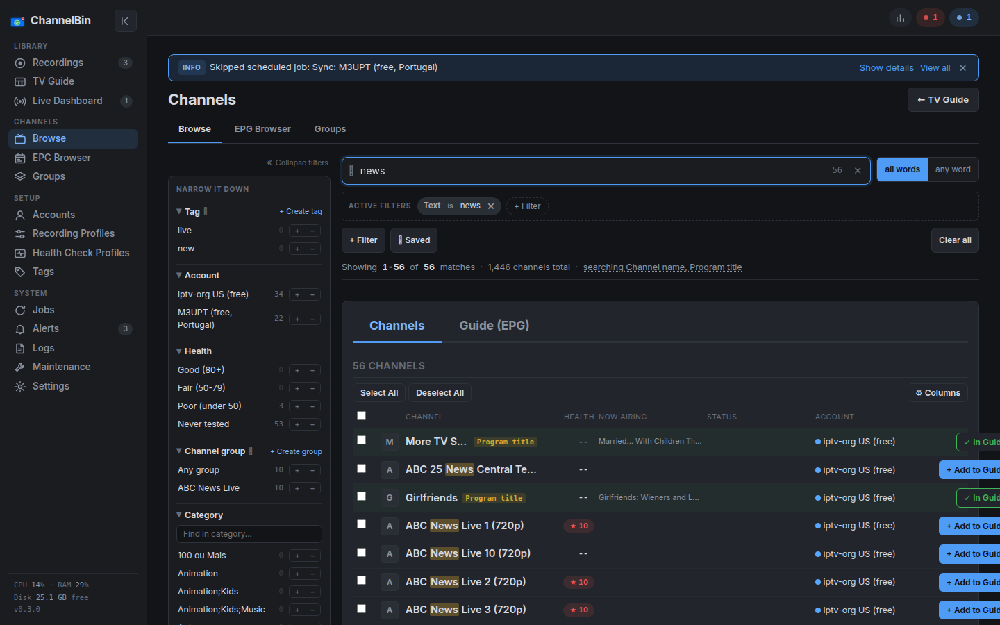
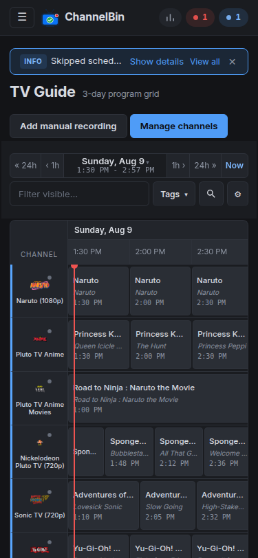

# ChannelBin

[](https://github.com/TheForgetfulDev/channelbin/actions/workflows/tests.yml)

ChannelBin is a self-hosted IPTV channel tester and recorder (DVR).

## What and Why ChannelBin Exists

I had two major problems I wanted to solve: I wanted to record shows I couldn't watch live, and I wanted to understand what IPTV channels I actually have.

### Record channels (DVR)
I tried a number of different tools for this and they all worked great when your provider and internet are solid, but apparently mine aren't. I would sit down expecting to watch a 4 hour recording of an event, only to find it had stopped after 49 minutes.

ChannelBin makes every possible effort to complete a recording. That means constantly monitoring the stream and restarting every time it stops, while also being able to automatically switch to alternate channels and alternate accounts when they're available. 

### Know what channels I have
I have several IPTV providers, each with 30,000+ channels. There are plenty of existing tools that can help me organize them and hide channels and groups I don't care about, but I couldn't find anything that answered the questions I had... which of the 20+ seemingly identical channels was the best one to watch an event on? Which ones actually work? Which ones are just duplicates of the same channel? Which ones are actually 4k or 1080p@60fps?

ChannelBin has health check and health/quality scoring. It connects to a channel, measures what data it receives, grabs a screenshot, captures all metadata, and keeps a score of the channel over time.

I also added a channel and EPG browser and search to help me find what's even out there. 

The same event often airs on dozens of different channels in different regions. There are different announcers, different commercials (or no commercials), and different streams that I didn't even know existed. Or sometimes I want to record a live event after it already happened but I don't know where to look to find another airing. 

It's actually been really fun using the search and surfacing channels that I didn't know I had.

---

## Contents

- [What it does not do](#what-it-does-not-do)
- [Features](#features)
- [Install](#install)
  - [Docker](#docker-recommended)
  - [Unraid](#unraid)
  - [GPU conversion (optional)](#gpu-conversion-optional)
  - [Running it directly](#running-it-directly)
- [First run](#first-run)
- [Configuration](#configuration)
- [Network binding and exposure](#network-binding-and-exposure)
- [Output files](#output-files)
- [Backup and restore](#backup-and-restore)
- [Moving to another machine](#moving-to-another-machine)
- [Versioning and upgrades](#versioning-and-upgrades)
- [Home Assistant integration](#home-assistant-integration)
- [Troubleshooting a provider sync](#troubleshooting-a-provider-sync)
- [How I use AI on this project](#how-i-use-ai-on-this-project)
- [Feedback and contributions](#feedback-and-contributions)
- [Architecture, briefly](#architecture-briefly)
- [License](#license)

---


## What it does not do

ChannelBin has no EPG source of its own. 

It imports guide data from your provider's XMLTV or
Xtream feed and builds everything on top of that. If your provider's EPG is thin, wrong, or badly
matched to its own channels, ChannelBin will faithfully show you thin, wrong, badly matched data.
It expects you to already have EPG you trust from somewhere. Fixing bad guide data is not a
problem this app solves.

It also does not stream to you, transcode on the fly, or replace a media server. It records files
and hands them to whatever you already use to watch them.

## Features

**Recording**

- Schedule by channel, group, or raw URL, one time or on a recurring schedule.
- Stall detection with automatic restart, then concatenation of every segment into one file.
  Configurable stall timeout, restart delay, and failure ceiling.
- Fast-fail handling for a stream that never really starts, so a dead feed does not burn an
  entire recording window pretending to work.
- Failover to the next-highest-scored member of a group when the active feed dies mid-recording.
- Post-processing to mp4 or mkv, with re-encode triggered only when the capture is measurably
  damaged (or always, or never).
- Filename templates with a live preview and tag cleanup, plus an optional move to a finished
  directory and an optional post-recording script.
- Recording profiles, so a set of capture and post-processing choices can be applied by name.
- Optional retention sweep for old recordings.



**Knowing what happened**

- A live dashboard with elapsed and remaining time, bytes captured, stall count, failure count,
  and a periodically refreshed thumbnail of the frame being recorded right now.
- A per-recording event log: every stall, restart, failover, and conversion step with timestamps
  and reasons.
- A segment breakdown with the size and duration of every individual ffmpeg run.
- Capture diagnostics kept alongside the recording, so a failed capture can say why it failed
  rather than just that it did.
- Alerts, with optional push delivery to Discord, Pushover, Home Assistant, email, or WhatsApp
  via Apprise service URLs, rate limited so one bad night does not become forty notifications.



**Channels and health**

- Health checks that connect to a channel, measure resolution and bitrate against configurable
  thresholds, capture screenshots, and record the result.
- A live preview: watch or listen to a channel's actual stream from its page, to confirm it is
  the right channel and that it plays before a recording relies on it. The stream is copied
  into a short HLS window, never re-encoded, and a preview gives its connection up to any
  recording that needs it.
- A rolling health score per channel, weighted toward recent observations, fed by both health
  checks and what real recordings actually produced.
- Health check profiles and a nightly maintenance window, so checks run when nothing else needs
  the connection.
- Groups: collect the duplicate feeds of one logical channel under a single name that appears
  once in the guide, ranked by score, with a suggest-duplicates helper to build them.
- Per-account connection limits, so ChannelBin never opens more simultaneous streams to a
  provider than the account actually allows.



**Guide and search**

- A scrollable multi-day TV Guide grid built from your imported EPG, with recording indicators
  on programs that are already scheduled.
- Channel search and airing search over the whole catalog, with filters, facets, saved columns,
  and a search that stays responsive on a catalog of well over a hundred thousand channels.
- An EPG browser for finding a program across every channel that carries it.
- Tags for organizing channels your own way.



**Accounts and operations**

- Xtream and M3U/XMLTV accounts, synced on a schedule, with sync logs and a sync that stands
  aside when a recording is running or about to start.
- A jobs page listing every scheduled job with its next run time, and a maintenance page.
- Log viewer, in-app settings editor, automatic config and database backups, and a sanitized
  support bundle for sharing diagnostics without sharing credentials.
- Optional password gate for the whole app.
- A read-only Home Assistant integration.



---

## Install

### Docker (recommended)

```bash
curl -fsSLo docker-compose.yml \
  https://raw.githubusercontent.com/TheForgetfulDev/channelbin/main/docker-compose.example.yml
# edit the two volume paths and PUID/PGID, then:
docker compose up -d
docker compose logs -f
```

Open [http://localhost:5000](http://localhost:5000). ffmpeg is in the image; nothing else to
install.

The image is `ghcr.io/theforgetfuldev/channelbin`, published for amd64. The example compose
file pins a release version rather than `latest`, so an update happens when you move the pin
and never in the middle of a recording. `:latest` exists for trying it out by hand. To build
the image yourself, clone the repo and replace the `image:` line with `build: .`.

Converting recordings on a GPU is optional and needs one extra line in the compose file - see
[GPU conversion](#gpu-conversion-optional).

#### Volumes

| Mount | Holds |
|---|---|
| `/config` | `config.yaml`, the database (`dvr.db`), `instance/` (the generated secret key, database and config backups) |
| `/dvr` | recordings, live thumbnails, health check screenshots |

On first start the container writes a short starter `config.yaml` into `/config` and drops the
full annotated template beside it as `config.example.yaml`. Edit either the file or Settings in
the web UI - both write to the same place. Everything that must survive an image upgrade lives
on these two volumes; nothing is kept in the container.

#### PUID / PGID

The container writes to the mounts as `PUID:PGID` (default `1000:1000`) rather than as root, so
your recordings are owned by a real account on the host. Set them to your own `id -u` / `id -g`.
The `/config` volume is chowned to match at every start; `/dvr` deliberately is not (it is
routinely a large share). ChannelBin checks every folder it is configured to write to - recordings,
thumbnails, screenshots, backups - and one it cannot write shows up in the Readiness check on
Maintenance and as an alert, with the uid it was checked as.

`TZ` sets the container's clock. It does **not** set the app's display timezone - that is
`display.timezone` in `config.yaml`, so scheduled times mean the same thing either way.

#### Restarting

Some settings need a restart, and Settings has a Restart button. Inside a container it works by
exiting the process, so **`restart: unless-stopped` (as in the example compose file) is what
brings the app back** - without a restart policy the container simply stops.

### Unraid

The Unraid template is [`docker/unraid-template.xml`](docker/unraid-template.xml). It maps the
same two volumes, defaults PUID/PGID to Unraid's `99`/`100`, and sets `--restart=unless-stopped`
under Extra Parameters - keep that, for the reason above. Unraid's autostart toggle is not a
restart policy.

- **Appdata (`/config`) holds the database, so keep it off the array.** Use an appdata share
  that lives on a pool only, or point it at the pool path directly
  (`/mnt/cache/appdata/channelbin`).
- **Map `/dvr` itself, not subfolders of it.** Thumbnails, health check screenshots,
  cached logos and profile poster images default to `/dvr/images`. With only subfolders mapped, they land in an
  unmapped volume inside `docker.img` and are lost when the container is updated.
- **Completed recordings** is an optional second path, mounted at `/dvr-complete`, for filing
  finished recordings somewhere outside the recordings share. Turn on **Move on complete** in
  Settings with that as the destination. A subfolder of `/dvr` works just as well and is
  faster, because the move is then a rename rather than a copy.
- **Images** is another optional path, mounted at `/images`, for keeping thumbnails, health
  check screenshots and cached logos off the recordings share. Set **Images directory** in
  Settings to `/images`; left unmapped, they go to `/dvr/images`.

Unlike the compose example, the template tracks `latest`: Unraid keeps the tag a container was
created with, so a pinned template would never show an update. Update between recordings.

The template has no GPU field, because Unraid cannot leave a device field empty: it passes
`--device=''` and the container refuses to start. To convert on the GPU, add
`--device=/dev/dri` to Extra Parameters yourself - see [GPU conversion](#gpu-conversion-optional).

### GPU conversion (optional)

When a recording is re-encoded to MP4, ChannelBin can hand the video to an Intel Quick Sync or
AMD GPU through VAAPI instead of libx264 on the CPU. On a 1080p60 recording that took about a
fifth of the CPU time for the same file size and picture quality. It needs two things: the
host's `/dev/dri` passed into the container, and the setting turned on.

**Pass `/dev/dri` as a device, not a volume.** Mapped as a volume the container can see the
device but is not allowed to open it, and every GPU encode fails with "Operation not
permitted". The three ways to write it:

| Where | What to add |
|---|---|
| Unraid | `--device=/dev/dri` in Extra Parameters (Advanced View), after `--restart=unless-stopped` |
| Docker Compose | `devices:` with `- /dev/dri:/dev/dri` (commented out in the example compose file) |
| `docker run` | `--device /dev/dri` |

Leave it out on a machine with no GPU: docker will not start a container whose device does not
exist. It works on Linux hosts only; Docker Desktop on Windows or macOS, and WSL, do not pass a
VAAPI device through.

You do not need to add the container to the host's `render` or `video` group. At every start
the container gives its own user access to whatever group owns the device it was handed, and
says so in its log.

**Then turn it on:** Settings > Recording, **Video encoder** = GPU (VAAPI). It is shown once
post-processing is on and re-encoding is allowed. **GPU device** defaults to
`/dev/dri/renderD128`, which is right on almost every machine with one GPU. Maintenance >
Readiness has a **The GPU encoder works** check that runs a one-second test encode on the
device.

If the GPU is missing or fails, the conversion still finishes in software with libx264. The
recording's event log says which encoder did the work and why it fell back, and a device that
fails its test encode also raises an alert naming the reason.

Running without Docker, the same setting works if your ffmpeg has `h264_vaapi`, the VAAPI
driver for your GPU is installed (`intel-media-va-driver` on Debian and Ubuntu), and the user
running ChannelBin can open the render node (usually by being in the `render` group).

### Running it directly

Python 3.12 and ffmpeg. Both `ffmpeg` and `ffprobe` are required and are installed together
by the command below - ChannelBin bundles neither, and Maintenance > External tools reports
which ones it resolved.

**ChannelBin targets ffmpeg 7.1.** That is what the container ships, what Debian 13 provides,
and the one series the test suite runs against in CI - on the full suite and on real captures,
conversions, probes, health checks and screenshots up to 4K HEVC 10-bit. Other series are
untested rather than known-bad, and one of them is common: Ubuntu 24.04's `apt` gives you 6.1,
which measured identical when it was checked but is no longer exercised by anything. If your
ffmpeg is not 7.1 and something misbehaves, the version on Maintenance > External tools is the
first thing to report.

```bash
sudo apt install ffmpeg
pip install -r requirements.txt
# Ubuntu 23.04+ manages Python packages externally (PEP 668), so either add
# --break-system-packages to that command or use a virtualenv:
#   python3 -m venv .venv && source .venv/bin/activate && pip install -r requirements.txt

# A writable output directory, owned by the user that runs the app:
sudo mkdir -p /dvr && sudo chown $USER:$USER /dvr

python3 run.py
```

Open [http://localhost:5000](http://localhost:5000).

The app starts with sensible built-in defaults and needs no config file at all. To customize,
`cp config.example.yaml config.yaml` and edit what you want; every key you leave out keeps its
default.

## First run

1. **Add an account** under Accounts: an Xtream login, or an M3U playlist URL plus an XMLTV EPG
   URL. Save it and run a sync. The first sync of a large provider takes a while and reports what
   it imported.
2. **Look at the guide.** Programs come from the EPG your account supplied. If the guide is empty
   or misaligned, that is a signal about the EPG feed, not about ChannelBin.
3. **Group your duplicate feeds** for the channels you care about most, under Groups. This is the
   single highest-value setup step: it is what lets a recording pick the best feed at start time
   and fail over mid-recording.
4. **Run health checks** on those groups so the scores mean something before you rely on them.
5. **Schedule a recording** from the guide, or from Recordings for a manual one, and watch it on
   the Live Dashboard.

## Configuration

Everything lives in `config.yaml`, editable from Settings in the web UI or directly on disk.
`config.example.yaml` is the annotated reference: every value in it is the built-in default, so
copying it changes nothing until you edit it, and it carries every setting a normal install would
ever set. The table below is only the handful people change first.

| Setting | Default | Description |
|---|---|---|
| `recording.dvr_output_dir` | `/dvr` | Where segments and the in-progress file are written |
| `recording.post_process.format` | `mp4` | Convert finished recordings to `mp4` or `mkv` |
| `recording.post_process.reencode_mode` | `damaged` | Re-encode only damaged captures, `always`, or `never` |
| `recording.move_on_complete.destination` | none | Where finished files move to, when enabled |
| `recording.filename_template` | `{date} - {title} - {sub_title} - {channel}` | Output filename pattern |
| `watchdog.stall_timeout_seconds` | 30 | Seconds of no file growth before declaring the stream dead |
| `watchdog.restart_delay_seconds` | 30 | Seconds to wait before restarting after a stall |
| `watchdog.max_consecutive_failures` | 10 | Give up (or fail over) after this many failed restarts |
| `watchdog.stall_move_count` | 3 | Move a group recording to another member after this many stalls in the window below, even when every restart succeeds. 0 disables |
| `watchdog.stall_move_window_minutes` | 30 | The rolling window those stalls must fall inside |
| `accounts.default_max_connections` | 1 | Simultaneous connections allowed per provider account |
| `sync.sync_interval_hours` | 12 | How often accounts re-sync |
| `sync.epg_days_ahead` | 3 | Days of future EPG to import, and the width of the guide grid |
| `display.timezone` | `America/New_York` | Any IANA timezone; all display times use it |
| `display.time_format` | `12h` | `12h` or `24h` |
| `flask.port` | 5000 | Web UI port |
| `flask.host` | `0.0.0.0` | Bind address, see below |
| `ffmpeg.extra_input_args` | `[]` | Extra ffmpeg arguments before `-i` |

## Network binding and exposure

By default the app binds `0.0.0.0`, so it is reachable from **every device on your LAN**. This is
intentional: `0.0.0.0` is the only bind that works across all deployment topologies (direct LAN
use, a reverse proxy on the same host, a proxy on a separate host, VM, or container).

There is an **optional password gate** (off by default) under Settings > Security: turn on
`auth.enabled` and set a password, and every page and API endpoint requires signing in. Read this
plainly - **it is a door on something that was standing open, not a hardened, internet-grade auth
system.** One shared password, no usernames, no accounts, no roles, no 2FA. It raises the bar from
"anyone who can reach this server" to "anyone who can reach this server and knows the password" -
worth having, and not by itself a reason to expose the app to the internet.

**Do not expose this app directly to the internet, gate on or off.** Settings controls that
execute code on this machine - the post-recording script (`recording.post_script.path`) and the
`ffmpeg.path` binary path - mean anyone who can authenticate (or, with the gate off, anyone
who can simply reach the web UI) has arbitrary command execution as the app's OS user, not just the
ability to reschedule a recording. CSRF does not help either way: it only stops a malicious website
forging a request through your browser, and does nothing once someone can reach the server
directly. If you need remote access, put it behind a VPN or a reverse proxy that itself requires
authentication (HTTP basic auth, an OAuth proxy, Tailscale, etc.) in addition to the password gate,
not instead of it.

If - and only if - your reverse proxy runs on the **same machine** as ChannelBin, you can set
`flask.host: 127.0.0.1` so the raw port is unreachable except from the proxy itself. **Do not** set
this if the proxy, or the devices you browse from, run on a different host: it will make the app
unreachable (connection refused) rather than tightening it.

### Password gate: forgotten password / locked out

The gate has no "forgot password" flow (there are no email addresses or accounts to reset with) -
recovery means editing `config.yaml` with shell access to the machine, which is also why the gate
protects against the **network**, not against someone who already has shell access to this box:

1. Open `config.yaml` and find the `auth:` block.
2. Set `enabled: false` (leave `password_hash` alone - you don't need to touch it, though
   clearing it to `''` in the same edit is harmless and does the same thing).
3. Restart the app.
4. The app is reachable with no password again. Go to Settings > Security and set a new password,
   then turn `auth.enabled` back on from the GUI. Setting a new password here does **not** ask for
   the old one, because with the gate off there is nothing to prove: anyone who can reach the app
   at that moment can already change anything. Once the gate is back on, changing the password
   requires the current one as usual.

Two related notes:

- **Changing the password signs out every other device.** Each session is stamped with which
  password it was issued against, so a change invalidates all of them - the browser you changed it
  in stays signed in, everything else has to sign in again. That is the way to evict a session you
  are not happy about.
- **Rotating `flask.secret_key`** (or deleting `instance/secret_key` so a new one is generated)
  invalidates every existing session cookie - it signs everyone, on every device, out at once.
  That is a legitimate way to force a re-login everywhere, not just an auth-gate detail.
- **Lockout counts by client IP**, which is only the real visitor when `flask.behind_proxy` is on
  *and* your reverse proxy appends to `X-Forwarded-For` rather than passing the client's own copy
  through (nginx: `proxy_set_header X-Forwarded-For $proxy_add_x_forwarded_for`, not
  `$http_x_forwarded_for`). Forwarding it verbatim lets a caller present a fresh address per
  attempt and never trip the lockout. With `behind_proxy` off, every request through a proxy looks
  like one IP instead, so a single attacker can lock the whole LAN out of signing in for 15
  minutes. Neither weakens the password itself; both are worth getting right before relying on the
  lockout as more than a speed bump.
- **`auth.cookie_secure`** is the switch for an always-HTTPS deployment (e.g. behind a
  TLS-terminating reverse proxy). Leave it `false` on a plain-HTTP LAN setup - a `Secure` cookie
  is never sent over plain HTTP, so turning this on without HTTPS in front of the app locks
  everyone out immediately, including you. It requires a restart to take effect.

## Output files

Recordings are written to `recording.dvr_output_dir` (default `/dvr`) and, if
`recording.move_on_complete` is enabled, moved to its destination when finished.

During recording, temporary segment files exist as `<name>_seg_000.ts`, `_seg_001.ts`, and so on.
They are deleted after successful concatenation. With post-processing enabled the concatenated
`.ts` is converted to mp4 or mkv, and the source `.ts` is deleted if
`recording.post_process.delete_source` is on.

## Backup and restore

ChannelBin's whole state is exactly three paths:

- `dvr.db` - the SQLite database (recordings, channels, accounts, EPG, everything else)
- `config.yaml` - your settings, including provider account credentials
- `instance/` - the auto-generated Flask signing key (`instance/secret_key`), plus the
  `config-backups/` and `db-backups/` subdirectories from the automatic backups below

Nothing outside those three paths carries state that survives a restart.

**To back up:** stop the app, then copy the three paths somewhere else. Stopping first guarantees
a consistent snapshot; there is no live-backup tooling built in.

**To restore:** put the three paths back in the same relative layout and start the app. That is
the whole procedure - there is no restore command or wizard.

**Why there is no export/import feature:** a sanitized export cannot be re-imported (the secrets
are what make it work) and an importable export cannot be sanitized, so one feature cannot serve
both purposes. This file-set copy *is* the backup and restore story. The Support Bundle
(Settings > Backup & Restore) is the separate, sanitized-for-sharing diagnostic story - it is for
getting troubleshooting data to someone else, not for restoring your own install.

### Automatic backups

Before any database migration runs, the app snapshots the database automatically:

- **When:** only on a startup that actually has pending schema migrations, which means the first
  start after upgrading to a release that changes the schema. Normal restarts take no backup.
- **Where:** `database.backup_dir` in `config.yaml` (default `instance/db-backups`, relative to
  the app directory), named `dvr-pre-schema-v<N>-<timestamp>.db`, where `<N>` is the schema
  version the upgrade is about to apply - so the file named `v5` is the state of your database
  from *before* migration 5 ran.
- **What:** a compacted, self-contained copy (made with `VACUUM INTO`), valid on its own, with no
  `-wal`/`-shm` sidecar files needed. It is built on the database's local disk first and then
  moved into `backup_dir`, so the drive holding `dvr.db` transiently needs about one database's
  worth of free space; the backup dir itself can be a network share.
- **Keep it off shared storage.** A snapshot is your whole database, which stores provider
  account credentials in plaintext, and a config backup is `config.yaml` verbatim (signing key,
  notification webhook tokens). Both default to `instance/`, on local disk, and a directory the
  app creates is `0700`. Pointing either `backup_dir` at a network share or a directory other
  users can read hands those secrets to everyone who can read it.
- **Retention:** the newest `database.migration_backups_keep` snapshots are kept (default 3; set
  0 to keep all).
- **If the backup itself fails** (backup dir unwritable, disk full), the app refuses to start
  rather than migrating without a safety net. Fix `database.backup_dir`, or - if you accept the
  risk - set `database.pre_migration_backup: false`.

`config.yaml` gets the same treatment: it is copied into `config_backup.backup_dir` (default
`instance/config-backups`) before any config migration rewrites it, and on a daily schedule.

## Moving to another machine

ChannelBin's whole state is two files plus the generated key: `config.yaml` and the database.
Restoring them into a new install is the entire migration - the app adopts them on the next start,
and migrates the database forward if the backup came from an older version.

Take the newest of each from the old install:

- **the database** - `instance/db-backups/dvr-pre-schema-v*.db`, or just `dvr.db` itself (stop the
  app first, and take `dvr.db-wal` with it if you copy a live one)
- **the config** - `instance/config-backups/*-channelbin-config-backup.yaml`

With Docker:

```bash
mkdir -p config recordings
cp <the backup>.db                             config/dvr.db
cp <the backup>-channelbin-config-backup.yaml  config/config.yaml
# edit config/config.yaml - see the table below - then:
docker compose up -d
docker compose logs -f
```

**A config backup from a non-Docker install points at paths that do not exist in a container,
and the first one stops the app from starting at all.** Fix these before the first start:

| Key | Change it to | If you don't |
|---|---|---|
| `logging.file` | delete the line (logs go to stdout) | container exits immediately with `PermissionError` on the old machine's log directory |
| `database.path` | `/config/dvr.db` | the app looks for the database somewhere that isn't mounted |
| `recording.dvr_output_dir` | a path under `/dvr` | recordings write outside the volume, or fail |
| `recording.move_on_complete.destination` | a path under `/dvr` | finished recordings fail to move |
| `recording.post_script.path` | a path inside the container, or `enabled: false` | the post-script fails after every recording |
| `flask.serve_mockups` | `false` | serves a route that has no content in the image |

`database.backup_dir` and `config_backup.backup_dir` need no change - they are relative and land
on the `/config` volume by themselves.

Two things to expect on that first start:

- **A database from an older version is migrated forward, and it snapshots itself first.** The
  snapshot is a full copy of the database written to `/config`, so the volume needs room for two
  of them. Restoring a 1.1 GB database took about 11 seconds to snapshot and under a second to
  migrate; the app will not start if the snapshot fails, deliberately, since it is the only way
  back.
- **The app resumes the schedule it was carrying.** Account syncs and health checks belong to the
  restored database, so they start firing as soon as it boots. **Stop the old install first** -
  two copies polling the same provider account will collide on its connection limit, and can leave
  both looking broken.

## Versioning and upgrades

ChannelBin uses [semver](https://semver.org). The version lives in `app/version.py` and is shown
in the page footer. Pre-1.0, MINOR releases may include breaking changes. After 1.0: MAJOR may
need manual intervention, MINOR adds features (the app migrates your data automatically), PATCH
is fixes.

Every release is tagged `v<version>` and gets a section in [CHANGELOG.md](CHANGELOG.md).

**Upgrading** is automatic: on startup the app migrates `config.yaml` and the SQLite database to
the current version. Install the new code and start the app; there are no migration commands to
run.

### Recovering from a failed upgrade

If a migration fails, the app logs the failing migration number, rolls back that step, and refuses
to start; your pre-upgrade snapshot is intact. The same procedure also works if the upgrade
succeeded but you want to go back to the older release:

1. **Stop the app** and make sure no process is left running.
2. **Restore the snapshot:** copy the newest `dvr-pre-schema-v*.db` from your backup dir over
   `dvr.db`, and delete `dvr.db-wal` and `dvr.db-shm` if present (they belong to the replaced
   file):
   ```bash
   cp instance/db-backups/dvr-pre-schema-v2-2026-07-17-04-00-00.db /path/to/channelbin/dvr.db
   rm -f /path/to/channelbin/dvr.db-wal /path/to/channelbin/dvr.db-shm
   ```
3. **Reinstall the code version you were upgrading from** (e.g. `git checkout v0.1.0`). This step
   matters: if you start the *new* code against the restored database, it will simply attempt the
   same migration again - fine if you are retrying after fixing something like a full disk, wrong
   if you are trying to stay on the old version.
4. **Restore the matching config backup** if the release also migrated `config.yaml` - pick the
   newest file in `config_backup.backup_dir` from the moment of the upgrade, or use the config
   backups UI on the Settings page once the app is running.
5. **Start the app** and confirm the version in the page footer.

Anything recorded *after* the snapshot was taken is not in the snapshot. With automatic backups
that window is normally seconds long, but if you roll back days later, expect the database to be
from the moment of the upgrade.

To check where a database stands, its schema version is `PRAGMA user_version` and the applied
migration history (with app versions and timestamps) is in the `schema_migrations` table:

```bash
sqlite3 dvr.db 'PRAGMA user_version; SELECT * FROM schema_migrations;'
```

The app refuses to start against a database created by a newer version than the running code (the
error message says which versions are involved). That is the signal you are accidentally running
old code against an upgraded database, rather than anything being corrupted.

## Home Assistant integration

ChannelBin has a read-only Home Assistant integration. It allows you to see details like
what is recording right now, when your next upcoming recording is, unread alerts, account health
status, and more.

It lives in its own repository,
[channelbin-homeassistant](https://github.com/TheForgetfulDev/channelbin-homeassistant), which is
what HACS installs from. The full entity list, the requirements and every install method are
documented there.

### Turn the API on first

This half is done in ChannelBin, before you add anything in Home Assistant. Go to
**Settings > Integrations**:

1. Generate a Home Assistant API key. It is shown once - copy it before leaving the page, since
   only its hash is stored afterward.
2. Turn the **Home Assistant integration** switch on. It stays disabled until a key exists, which
   is why the key comes first.

Both are required. The status API rejects a request unless the switch is on and the key matches,
and it answers the same way in either case, so a switch left off looks exactly like a wrong key.

---

## Troubleshooting a provider sync

If a sync against an Xtream provider misbehaves, the last thing I want is to re-run it against
the live provider over and over while I poke at it - that just means more load on an account I
don't control. So there's a debug mode that captures every raw API response to disk once, then
lets me replay a sync from those files as many times as I want with no network calls at all.

It's off by default and hidden from the UI unless turned on.

**Turn it on for one account:** open that account's **Edit** modal and flip the **Xtream debug
mode** switch, then save. This only affects that one account - the rest of the app is untouched.

**Turn it on for every account:** in **Settings**, enable `debug.xtream_debug_mode`. Only do this
if you're troubleshooting something that isn't tied to one account - it's a wider net.

Once debug mode is on for an account (either way), its page's overflow menu grows two extra
items:

- **Fetch & dump** - calls every Xtream API endpoint for that account (auth, categories, live
  streams, EPG) and writes each raw response to
  `instance/xtream-dumps/<account_id>/<yyyy-mm-dd>_<NN>/` (`<NN>` increments if you dump the same
  account more than once on the same day). Nothing is written to the database - this step only
  captures.
- **Sync from dump** - runs a normal sync, except it reads from the most recent dump directory
  instead of the network. Use this to reproduce and iterate on a sync bug without touching the
  provider again.

**A dump stores your provider credentials in plaintext.** Xtream stream URLs embed the
account's username and password directly in the path, and the raw playlist/API responses are
written to disk exactly as the provider sent them - so every dump directory contains them too.
The dump directory is created private (`chmod 700`) for that reason, but nothing encrypts the
files themselves: treat a dump like you would `config.yaml`, and don't share one without
scrubbing it first.

`debug.xtream_dump_dir` in `config.yaml` can point dumps somewhere other than
`instance/xtream-dumps/` if you need to.

---

## How I use AI on this project

ChannelBin was built with heavy AI assistance, and I would rather say that plainly up front than
have you work it out from the commit history.

I am an engineering manager with an IT and software background, and I treat AI the way I would
treat a capable junior developer. Every task, however small, goes through a planning step that I
review before any code is written. The output then gets a full code review from me, and changes
get tested - by the automated suite and by me actually using them. The AI does not decide what
this app is or how it behaves; it does a lot of the typing, and it does it under review.

That process is also why this repo has the shape it does. The project carries an unusually
detailed set of written standards, and the reasoning behind a decision tends to be recorded next
to the code that implements it, because that is what makes review possible at this pace. Those
standards themselves stay in the private repo I develop in, so you will see comments citing files
that are not here - [docs/CONVENTIONS.md](docs/CONVENTIONS.md) explains what they are and why you do
not need them to read the code.

The honest summary: I wrote this for myself, I have used and maintained it as my own DVR for
months, and everything in it has had a human deciding it was correct. If you would rather not run
AI-assisted code, that is a completely reasonable position, and I would rather you know now.

## Feedback and contributions

Bug reports and feature requests are welcome. I cannot promise to implement requests - this is
something I built for my own use and maintain in my own time - but I do read them, and a clear bug
report with logs is genuinely useful.

If you are sending a pull request, see [CONTRIBUTING.md](CONTRIBUTING.md) for the commit message
convention and the versioning and tagging policy.

For a diagnostic dump that is safe to share, use **Settings > Backup & Restore > Support Bundle** -
it redacts credentials and URLs on the way out, so you can attach it to an issue without leaking
your provider details.

## Architecture, briefly

```
Flask (threaded)
├── APScheduler   - fires start/stop, sync and health-check jobs (persisted to SQLite)
├── SQLite        - recordings, events, segments, channels, accounts, EPG
├── One watchdog thread per recording - polls output growth, detects stalls, restarts, fails over
├── Post-processor - concatenate, measure, convert, move
└── SSE           - the watchdog publishes events; the dashboard and guide subscribe
```

Python 3.12, Flask, Flask-SQLAlchemy, APScheduler 3.x, ffmpeg. No external database, no message
broker, no other services to run.

## License

MIT. See [LICENSE](LICENSE).

One third-party library ships in the repo: [hls.js](https://github.com/video-dev/hls.js), under
the Apache License 2.0, in `static/vendor/hls.js/` with its license text and a notice naming the
version. It plays the live channel preview in browsers without native HLS support.
